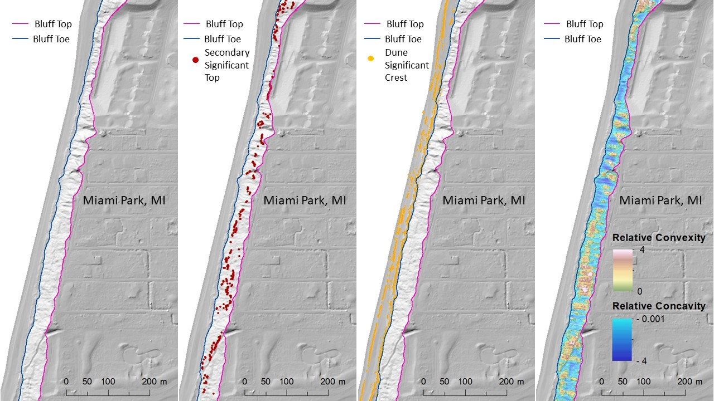

# iBluff - Geomorphic Analysis of Coastal Bluffs/Cliffs


#### Author:           Monica Palaseanu-Lovejoy
#### Point of contact: Monica Palaseanu-Lovejoy (mpal@usgs.gov)
#### Repository Type:  Formal _R_ language package
#### Year of Origin:   2021 (original publication)
#### Year of Version:  2021
#### Version: 1.0.0    
#### Digital Object Identifier (DOI):  **https://doi.org/10.5066/P9HJ7QHD**
#### USGS Information Product Data System (IPDS) no.: IP–126299 (internal agency tracking)

***

_Suggested Citation:_

Palaseanu-Lovejoy, M., 2021, iBluff - Geomorphic analysis of coastal bluffs / cliffs. https://doi.org/10.5066/P9HJ7QHD [https://code.usgs.gov/gmegsc/ibluff.git]

_Authors' [ORCID](https://orcid.org) no.:_
Monica Palaseanu-Lovejoy, [0000-0002-3786-5118](https://orcid.org/0000-0002-3786-5118)

***
***

# DESCRIPTION

The **iBluff** package in the *R* language (R Development Core Team, 2021) provides an environment for conducting morphological analysis of coastal bluffs / cliffs and offers an automatic and reproducible alternative for identifying top and toe instead of hand digitizing. This package extracts elevation profiles along automatically identified pseudo-perpendicular transects on the bluff face, bluff/cliff top, toe, secondary inflections, relative concavity/convexity of bluff/cliff face, and beach dunes (dune crests and troughs) without knowing *a priori* the number of dunes to be identified. The methodology is described in Palaseanu-Lovejoy *et al.*, 2016 and Payo *et al*., 2018.

This package requires at a minimum a bare earth digital elevation model (DEM) as a raster (e.g. GEOTIFF in tif format) and a generalized line shapefile shoreline approximately parallel with the bluff/cliff face. Both files should be in the same projected coordinate system (e.g. Universal Transverse Mercator (UTM) ). The shoreline has at a minimum in its attribute table an "ID" column that represents a unique identification number for each shoreline segment and a "buff_dist" column that has the buffer distance expressed in the projection units. 

This package is dependent on the following R packages:

`data.table`  - Extension of `data.frame` (Dowle, M., and Srinivasan, A., 2020)

`raster` - Geographic Data Analysis and Modeling (Hijmans, R. J., 2020)

`rgdal` - Bindings for the Geospatial Data Abstraction Library (Bivand, R., Keitt, T., and Rowlingson, B., 2020)

`rgeos` - Interface to Geometry Engine - Open Source (GEOS) (Bivand, R. and Rundel, C., 2020)

`sp` -  Classes and methods for spatial data in R (Pebesma, E.J., R.S. Bivand, 2005, Bivand, R., Pebesma, E. and Gomez-Rubio, V., 2013)

`stringr` - Simple, Consistent Wrappers for Common String Operations (Wickham, H., 2019)

`zoo` - S3 Infrastructure for Regular and Irregular Time Series (Zeileis, A. and Grothendieck, G., 2005)

The justification for the **iBluff** package is that automatic procedures are fully reproducible and comparable, resulting in comprehensive features derived independently of human skill. The positions of coastal bluff/cliff tops and toes are considered key indicators of bluff/cliff erosion and the quantification of bluff/cliff retreat rates is vital for stakeholders who manage coastal protection and land use. Automatic extraction of bluff/cliff top and toe positions from topographic data will provide valuable constraints on coastal dynamics that will aid planning decisions, particularly where multitemporal data are available, and thus facilitate better understanding of coastal change. 

The automatic delineation method based on bluff/cliff detrended elevations (Palaseanu-Lovejoy *et al*., 2016, Payo *et al*., 2018) has proven useful in resolving a wide range of bluff/cliff types, from almost-vertical cliffs with sharply defined top and toe inflection points to complex cliff profiles, such as cliffs with roads or terraces cut through the cliff gradient, cliffs with different erosional profiles or slope gradients, or cliffs formed at the base of hills. The method is robust enough that the position of the top and toe of the cliff does not change with the length of the profile, as long as the cliff is the most prominent geomorphic feature present.

The package resides on the link shown in the _Suggested Citation_. Please consult this README along with other files (`DISCLAIMER.md`, `LICENSE.md`).

## Example of Use

The following example uses the data that is distributed with the iBluff package. The data consists of a topographic raster in GEOTIFF format (dem_demo.tif) at 1 m resolution and a multi-line shoreline shapefile (shore_line.shp). Both files have WGS84 UTM projection, zone 16 N, units meters. Both files are saved in `.inst/extdata` folder of the iBluff package.

1. Generate buffers around shoreline lines. The result is a list of projected SpatialPolygonsDataFrame.

```{r}
setwd("working directory")
coast1 <- system.file("extdata", "shore_line.shp", package = "iBluff")
buff1 <- bBluff(coast1, NA) 
# If you want the buffers to be saved as a polygon shapefile, provide a directory path instead of NA.
```

2. Extract single line from multi-line coastline shapefile. The result is a list of projected SpatialLinesDataFrame. This object will be a variable needed for the iBluff function `make.margins`.

```{r}
shore1 <- bCoast(coast1, NA)
# If you want the individual shorelines to be saved as a line shapefile, provide a directory path instead of NA.
```

3. Extract DEM inside the buffer. The result is a list of raster layers.

```{r}
dem1 <- system.file("extdata", "dem_demo.tif", package = "iBluff")
rast1 <- clip.rast(dem1, buff1,NA)
# If you want the DEMs to be saved as geotiff raster, provide a directory path instead of NA.
```

The rasters should have unique layer names in their properties because that name is recycled for names of subsequent files if they are saved on disk. If list of rasters (rast1 in this example) is saved on disk, the saved rasters will have automatic unique names in their property. If the rasters used are the list or raster layers result of `clip.rast` command instead of path to the rasters saved on disk, then change their inherited names from the original dem_demo.tif raster. For example:

```{r}
 names(rast1[[1]]) <- "dem1_80m"
 names(rast1[[2]]) <- "dem2_135m"
```

4. Extract the margins/sides of the buffers. (If shore1 has only 1 SpatialLinesDataFrame then use directly the `make.margins` function without `apply`).

```{r}
n <- length(shore1)
comb.n <-  combn(1:n,1)
marg1 <- apply(comb.n, 2, function(x)
   make.margins(buff1[[x]], shore1[[x]], rast1[[x]], NA))
# If you want the buffer margins to be saved as a line shapefile, provide a directory path instead of NA.
```

5. Extract transect locations. The result is a list of lists with transects as SpatialLinesDataFrame and Lines objects for each buffer.

```{r}
n <- length(marg1)
comb.n <-  combn(1:n,1)

trans1.all <- apply(comb.n, 2, function(x) 
	bTrans(marg1[[x]], dist1=NA, rast1[[x]], NA))
	
n2 <- length(trans1.all)
comb.n2 <- combn(1:n2, 1)

trans1 <- apply(comb.n2, 2, function(x) trans1.all[[x]][[1]])
lns1 <- apply(comb.n2, 2, function(x) trans1.all[[x]][[2]])
# If you want the transects to be saved as a line shapefile, provide a directory path instead of NA.
```

6. Extract elevation profiles along transects. The results is list of lists of data.frames, each table is a bluff/cliff elevation profile (see `iBluff::bProf` function help for more information). **Warning:** This function is slow to execute since it can take approximative 2 sec. to extract 1 profile and save it on disk. The function is faster without saving data on disk. 

```{r}
n3 <- length(lns1)
comb.n3 <- combn(1:n3,1)

profs <- apply(comb.n3, 2, function(x) 
	bProf(lns1[[x]], rast1[[x]], buff1[[x]], NA))
# If you want the profile tables to be saved as a comma delimited (csv) file, provide a directory path instead of NA.
```

7. Extract top and toe for each profile. The result is a complex list of four lists of data.frames for each processed buffer. First list within a buffer list has coordinates and ID for top of bluffs. Second list within a buffer list has coordinates and ID for toe of bluffs. Third list within a buffer list has the data used when parameter veg=TRUE. Fourth list within a buffer has the data used when parameter veg=FALSE (see `get.toptoe` function help).

```{r}
n4 <- length(profs)
comb.n4 <- combn(1:n4,1)

toptoe1 <- apply(comb.n4, 2, function(x)
	get.toptoe(profs[[x]], top.par=TRUE, veg=TRUE))
	
n5 <- length(toptoe1)
comb.n5 <- combn(1:n5, 1)

top1 <- apply(comb.n5, 2, function(x) toptoe1[[x]][[1]])
toe1 <- apply(comb.n5, 2, function(x) toptoe1[[x]][[2]])
prof.noveg <- apply(comb.n5, 2, function(x) toptoe1[[x]][[3]])
prof.orig <- apply(comb.n5, 2, function(x) toptoe1[[x]][[4]])

# Plotting results for first buffer:
library(data.table)
library(raster)
slope <- terrain(rast1[[1]], opt='slope')
aspect <- terrain(rast1[[1]], opt='aspect')

# create hillshade
dem.hill <- hillShade(slope, aspect, angle=0, direction=315)
plot(dem.hill, col=grey.colors(255, start=0, end=1), legend=FALSE)

top1a <- as.data.frame(rbindlist(top1[[1]]))
toe1a <- as.data.frame(rbindlist(toe1[[1]]))
points(top1a[,1], top1a[,2], pch=20, col="magenta", cex=0.3) # outliers were not removed
points(toe1a[,1], toe1a[,2], pch=20, col="blue", cex=0.3) # outliers were not removed
```

8. To save the point shapefiles, line and smooth line shapefiles for top & toe use `iBluff::make.shape` function.  The top and toe point shapefiles are needed if the outlier removal is desired using the function `iBluff::iFilter`. `iBluff::make.shape` function is valid for any spatial object to be saved as a shapefile.

```{r}
dir.name <-  "./Results"
dir.create(dir.name, showWarnings = FALSE)
dir.tops<-  "./Results/Tops"

n6 <- length(top1)
comb.n6 <- combn(1:n6, 1)

 apply(comb.n6, 2, function(x) 
	make.shape(top1[[x]], dir.tops, file.name="tops", 10, rast1[[x]]))
 
dir.toes<-  "./Results/Toes"  
n6 <- length(toe1)
comb.n6 <- combn(1:n6, 1)

apply(comb.n6, 2, function(x) 
	make.shape(toe1[[x]], dir.toes, file.name="toes", 10, rast1[[x]]))
```

9. Extract dune crest and trough on the beach profile. The beach profile is considered the profile from water to the toe of the bluff/cliff. To be processed, the beach profile should have at least 6 points of data, otherwise the profile is ignored. If you are interested in a relatively narrow beach that has less than 6 data points, please consider to artificially densify the points by linear interpolation between the existing points. The result is a list of lists of data.frames. Each list in the list of lists has 2 objects, the first represents the data.frame for dune crests and the second represents the data.frame for dune troughs for each considered buffer.

```{r}
n7 <- length(prof.noveg)
comb.n7 <-  combn(1:n7,1)

# Extract the beach profile from the original profile
profs1 <- apply(comb.n7, 2, function(x) 
	{n8<- length(prof.noveg[[x]]);
	comb.n8 <- combn(1:n8,1);
	apply(comb.n8, 2, function(i) 
		iBeach(prof.noveg[[x]][[i]], toe1[[x]]))})

n9 <- length(profs1)
comb.n9 <- combn(1:n9, 1)

dunes <- apply(comb.n9, 2, function(x)
   iDunes(profs1[[x]], splits=list(), rast1[[x]], NA))

dune.crest <- dunes[[1]]
dune.trough <- dunes[[2]]
# If you want dune crests and troughs points to be saved as a point shapefile, provide a directory path instead of NA.

# Plotting results for first buffer:
library(data.table)
library(raster)
slope <- terrain(rast1[[1]], opt='slope')
aspect <- terrain(rast1[[1]], opt='aspect')

# create hillshade
dem.hill <- hillShade(slope, aspect, angle=0, direction=315)
plot(dem.hill, col=grey.colors(255, start=0, end=1), legend=FALSE)

dune.crest <- dunes[[1]]
dune1 <- dune.crest[[1]]
n <- length(dune1)
comb.n <- combn(1:n, 1)
crest <- apply(comb.n, 2, function(x) as.data.frame(dune1[[x]]))
crest <- as.data.frame(rbindlist(crest))
crest <- na.omit(crest)

# Getting only crest with count = 11
crest11 <- crest[crest$count==11,]
points(crest11[,1], crest11[,2], pch=20,cex=0.3, col="red")
```

10. Relative Convexity / Concavity.  The function creates along bluff/cliff face profiles (between top and toe) a relative convex (positive values) / concave (negative values) raster, when the bluff parameter is TRUE, otherwise the convex/concave raster is created along the original profile length.

```{r}
n10 <- length(prof.noveg)
comb.n10 <- combn(1:n10,1)

# For bluff/cliff face:
cc1<- apply(comb.n10, 2, function(x) 
	iRastCC(prof.noveg[[x]], top1[[x]], toe1[[x]], rast1[[x]], bluff=TRUE, NA))

# For the original buffer profile length
cc2<- apply(comb.n10, 2, function(x) 
	iRastCC(prof.noveg[[x]], top1[[x]], toe1[[x]], rast1[[x]], bluff=FALSE, NA))

# If you want the convex/concave rasters to be saved as a GEOTIFF DEM, provide a directory path instead of NA.
            
# Plotting the convex/concave raster for the first buffer
slope <- terrain(rast1[[1]], opt='slope')
aspect <- terrain(ras1t[[1]], opt='aspect')

# create hillshade
dem.hill <- hillShade(slope, aspect, angle=0, direction=315)
plot(dem.hill, col=grey.colors(255, start=0, end=1), legend=FALSE)

plot(cc1[[1]], col=rainbow(8, start=0.5, end=1, alpha=0.7), 
breaks=c(-10,-5, -3, -1, 0, 1, 3, 5), add=TRUE)
```

11. Secondary inflections on the bluff/cliff face. The function looks for the major "positive" and "negative" inflections on the face of the bluff/cliff profile between top and toe. The result is a list of lists with two elements. The first element is a list of secondary tops data.frame (top2). The second element is a list of secondary toes data.frame (toe2). 

```{r}
n10 <- length(prof.noveg)
comb.n10 <- combn(1:n10,1)

sec.toptoe <- apply(comb.n10, 2, function(x)
	iBSecond(prof.noveg[[x]], top1[[x]], toe1[[x]], iHi=1))
	
n11 <- length(sec.toptoe)
comb.n11 <- combn(1:n11,1)

top2 <- apply(comb.n11, 2, function(x) sec.toptoe[[x]][[1]])
toe2 <- apply(comb.n11, 2, function(x) sec.toptoe[[x]][[2]])
```

12. Eliminate outliers from bluff/cliff tops and toes. Outliers are usually due to small errors in the bare earth DEMs such as remnants of vegetation or built environment (buildings, walls, fences, etc.). The function uses the box-and-whisker plot within a moving window to eliminate outliers that are outside 1.5 times the interquartile (IQR) range above the upper quartile (Q3) and below the lower quartile (Q1) (Q1-1.5IQR or Q3+1.5IQR). This function is intended to eliminate outliers in the bluff/cliff top or toe point shapeline. The result is a list of data.frames with x and y coordinates and other attributes that can be saved as a point and line shapefile when using function `iBluff::make.shape`. For the `iFilter` parameters see the function's help.

```{r}
dir.tops<-  "./Results/Tops"

pnt.top<-list.files(path=dir.tops,pattern="points.shp",
	full.names=TRUE)

n12 <- length(pnt.top)
comb.n12<- combn(1:n12,1)

 tops.nout <- apply(comb.n12, 2, function(x)
	iFilter(pnt.top[[x]], 20, 18))

dir.toes<-"./Results/Toes"

pnt.toe<-list.files(path=dir.toes,pattern="points.shp",
	full.names=TRUE)

n12 <- length(pnt.toe)
comb.n12<- combn(1:n12,1)

 toes.nout <- apply(comb.n12, 2, function(x)
	iFilter(pnt.toe[[x]], 20, 15))
                    
# Plotting tops and toes without outliers for the first buffer: 
slope <- terrain(rast1[[1]], opt='slope')
aspect <- terrain(rast1[[1]], opt='aspect')

# create hillshade
dem.hill <- hillShade(slope, aspect, angle=0, direction=315)
plot(dem.hill, col=grey.colors(255, start=0, end=1), legend=FALSE)

points(tops.nout[[1]][,1], tops.nout[[1]][,2], pch=20, col="magenta", cex=0.3) 
points(toes.nout[[1]][,1], toes.nout[[1]][,2], pch=20, col="blue", cex=0.3) 
```

# PACKAGE INSTALLATION

To get release updates, the package can be reinstalled using one of those example commands. 

### Option 1

The easiest and most straight forward way to install the iBluff package is to use Packages / Install package(s) from the R console menu. Then the package can be loaded for the current R session either using Packages / Load package from the R console menu or the following R command line:

```R
library(iBluff)
```

### Option 2

In the R console:

```R
library(devtools) 
install_gitlab("gmegsc/ibluff", host="https://code.usgs.gov/")
```


## Further Details

The _R_ documentation file `man/function_name.Rd` is the canonical starting point, and that starting point can be initiated after package installation through the following commands at the _R_ prompt:
```{r}
  library(iBluff)
  ?get.toptoe # e.g. help for the function get.toptoe
```
A copy of the user manual built by `R CMD Rd2pdf` as shown previously and renamed is `./inst/doc/iBluff_UserManual.pdf`. The user manual is provided within the source code repository for convenience.


# REPOSITORY CONTENTS

The following sections describe directories and most files found at the top-level of the **iBluff** repository. Some of the material is required for this repository to also be an _R_ package, whereas other material is for structured presentation of this repository to the general public.

## Top-Level Directories

1. The `./inst/` directory is a standard naming convention following _R_ packaging and
therein, it holds material that will be placed into the installation tree of the package but strictly does not contain the code or documentation of the package itself. The `./inst/www/` directory contains graphic material to enhance the home page of the package. 

3. The `./man` directory standard R-documentation formatted files (`.Rd`) that are needed for CRAN-compliant package checking, installation, and user manual building.

4. The `./R` directory contains the _R_ source code. There need not be a one-to-one correspondence in file counts between `./R` and `./man`. The  `./R` subdirectory contains all the R functions that are documented in `./man` plus a series of internal utility functions that are used by the main documented functions. The utility functions are too narrow in scope to have their own documentation since generally they replace a block of code that repeats within one or several main functions.

## Documentation Files not Installed

5. The `CONTRIBUTING.md` file is an expected standard file to have in a repository
and describes that the repository is not particularly open to inclusion of new material
from others than the authors and their immediate colleagues. The `./.Rbuildignore` file does not emplace the file at package installation.

6. The `DISCLAIMER.md` file provides a standard U.S. Geological Survey disclaimer of
software. The `./.Rbuildignore` file does not emplace the file at package installation.

7. The `LICENSE.md` is a standard file concerning the licensing details of this package. The `./.Rbuildignore` file does not emplace the file at package installation.

8. The `SUMMARY.txt` file is a short abstract concerning the repository itself. The authors have a need, as part of the review and publication process, to report a formal abstract on the information product, and this summary serves that purpose. The `./.Rbuildignore` file does not emplace the file at package installation.

## Required Files for a Source Code Repository to be an _R_ Package

9. The `DESCRIPTION` is a required _R_ package description of the package declaring the basic information, required dependencies, need for compiling, and other details.

10. The `NAMESPACE` is a required declaration of the imports that the package requires from other _R_ package along with the declaration of the functions that the **iBluff** package will export into the user's session with the `library(iBluff)` command.

11. The `NEWS` is an author-led record of release notes and other related topics to the repository's lifespan.


# REFERENCES

Bivand, R. and Rundel, C., 2020, rgeos: Interface to Geometry Engine Open Source (GEOS'. R package version 0.5-5 accessed on January 20, 2021, at https://CRAN.R-project.org/package=rgeos

Bivand, R., Keitt, T., and Rowlingson, B., 2020, rgdal: Bindings for the 'Geospatial' Data Abstraction Library. R package version 1.5-18 accessed on January 20, 2021, at https://CRAN.R-project.org/package=rgdal

Bivand, R., Pebesma, E. and Gomez-Rubio, V., 2013. Applied spatial data analysis with R, Second edition. Springer, NY.

Dowle, M., and Srinivasan, A., 2020, data.table: Extension of `data.frame`. R package version 1.13.4 accessed on January 20, 2021, at https://CRAN.R-project.org/package=data.table

Hijmans, R. J., 2020, raster: Geographic Data Analysis and Modeling. R package version 3.4-5 accessed on January 20, 2021, at https://CRAN.R-project.org/package=raster

Palaseanu-Lovejoy, M., Danielson, J., Thatcher, C., Foxgrover, A., Barnard, P., Brock, J., and Young, A., 2016, Automatic delineation of sea-cliff limits using lidar-derived high-resolution DEMs in southern California: Journal of Coastal Research, SI no. 76, p. 162–173, at http://dx.doi.org/10.2112/SI76-014

Payo, A., Antelo, B.J., Hurst, M., Palaseanu-Lovejoy, M., Williams, C., Jenkins, G., Lee, K., Favis-Mortlock, D., Barkwidth, A., Ellis, M.A., 2018, Development of an automatic delineation of cliff top and toe on very irregular platform coastlines*, Geoscientific Model Development* 11 (10) : 4317 – 4337, at https://doi.org/10.5194/gmd-11-4317-2018

Pebesma, E.J., R.S. Bivand, 2005, Classes and methods for spatial data in R. R News 5 (2), pp.9-13 accessed on January 20, 2021, at https://cran.r-project.org/doc/Rnews/Rnews_2005-2.pdf

R Development Core Team, 2021, R—A language and environment for statistical computing, R Foundation for Statistical Computing, Vienna, Austria, version 4.0.3, accessed on January 20, 2021, at https://www.R-project.org.

Wickham, H., 2019, stringr: Simple, Consistent Wrappers for Common String Operations. R package version 1.4.0 accessed on January 20, 2021, at https://CRAN.R-project.org/package=stringr

Zeileis, A. and Grothendieck, G., 2005, zoo: S3 Infrastructure for Regular and Irregular Time Series. Journal of Statistical Software, 14(6), 1-27. doi:10.18637/jss.v014.i06 
